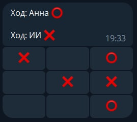

# TicTacToe Bot

## Задание: написать телеграм-бота для игры в крестики-нолики против ИИ

## Решение:

  

Телеграм-бот позволяет играть на поле размером 3х3.

Игрок за крестики определяется случайным образом.

Побеждает игрок, построивший линию из 3 фигур в ряд (горизонтально, вертикально или по диагонали).

## Использованные технологии
* Python 3.9;
* aiogram 3.x (Telegram Bot framework);
